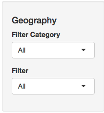
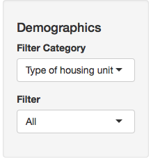
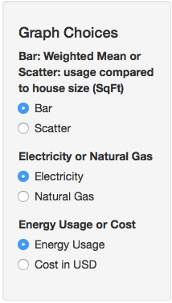
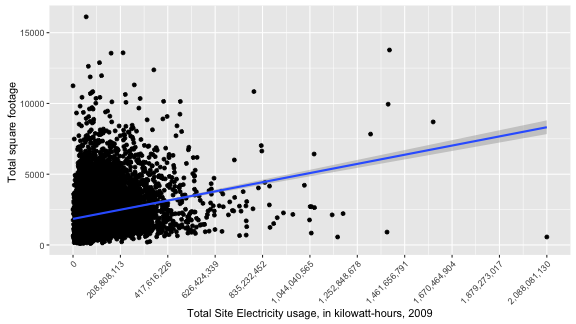

EIA RECS Data Browser
========================================================
author: Dan Goodman
date: September 24, 2016
width: 1440

Introduction
========================================================

Every five or six years, the United States Energy Information Administration (EID) publishes the results of a very detailed survey of residential energy consumption (RECS).  
This data product is a tool to be used to browse only a very small subset of this data.  The tool allows the user to filter the data set by different geographic regions as well as by some demographic variables such as house type, income level, etc.  The tool has two different chart types: bar chart and scatterplot.  Future enhancements could be allowing for chart facets by demographics and to break down the energy usage by end use category.  
Because I have not yet completed all of the Coursera Data Science statistical courses and the fact that I have no background in statistics, the calculations in this tool are rather simple.  The bar chart will show a weighted mean by demographic and the scatterplot will show any possible relationship energy usage/cost and size of house.  The scatterplot will represent a linear model line using ggplot2's stat_smooth(model=lm) function.  
This dataset took a fair amount of data wrangling to make a reproducible product.  I give a high level overview on the last slide.  I hope to use this dataset for my Capstone project.

Filters
========================================================
The tool has two filter sets: Geography and Demographics.  

Geography categories consist of US Census regions, US Census divisions, Climate Region and Urban/Rural classification.   
 

When a Geography Category is chosen, the Geography Filter select list is populated with all choices for that category.  An "All" option is included and is the default choice.   

 
If a filter other than "All" is selected, the data in the plot is just for the chosen geographic filter.   

 

 

Demographic filters consis of House type, Ownership/Rent status, Year range the house was built, Employment status, Education level and income level.   
The demographic filters work the same way as the geographic categories and filters.   

Chart Types
========================================================

 

Bar plot will show weighted mean of energy useage or cost for each demographic.  
Scatter plot will show energy usage or cost and house size (square footage) along with a regression line.  

 

Electricity energy usage is displayed in kilowatt hours (kWh) and natural gas energy usage is displayed in hundreds of cubic feet (ccf).   

 

Display energy usage in amount of electricity or natural gas or cost in USD of electricity or natural gas.  

Example Scatter Plot
========================================================

Data Processing
========================================================

This dataset took a bit of processing work to get it easy to plot and dynamically choose certain variables. 
Many of the variables, such as the geography and demographic variables used in this product, are reported as integers in the data file and the look ups for those values are provided in the codebok. 
The code in parse_2009.R will download the RECS data file and the codebook from the EIA's website if these files do not already exist in the eia_recs/data directory.  The dataset consists of 931 variables with 12083 observations. 
The codebook is parsed in order to get variable names and descriptions.  A lookup data frame is also created for response values and labels so that these variables could be converted to factors.

<!-- html table generated in R 3.3.1 by xtable 1.8-2 package -->
<!-- Sat Sep 24 19:41:12 2016 -->
<table border=1>
<tr> <th>  </th> <th> variable_name </th> <th> response_code </th> <th> response_label </th>  </tr>
  <tr> <td align="right"> 1 </td> <td> REGIONC </td> <td> 1 </td> <td> Northeast Census Region </td> </tr>
  <tr> <td align="right"> 2 </td> <td> REGIONC </td> <td> 2 </td> <td> Midwest Census Region </td> </tr>
  <tr> <td align="right"> 3 </td> <td> REGIONC </td> <td> 3 </td> <td> South Census Region </td> </tr>
  <tr> <td align="right"> 4 </td> <td> REGIONC </td> <td> 4 </td> <td> West Census Region </td> </tr>
  <tr> <td align="right"> 5 </td> <td> DIVISION </td> <td> 1 </td> <td> New England Census Division (CT, MA, ME, NH, RI, VT) </td> </tr>
   </table>
